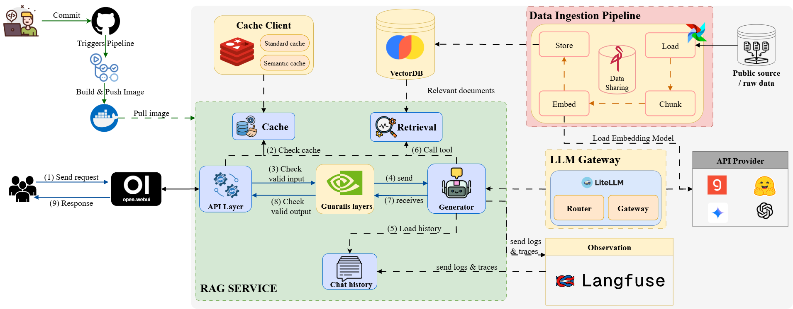

# End-to-End RAG Chatbot System with Langchain: From Ingestion to Guardrails

## Overview
This project implements a complete Retrieval-Augmented Generation (RAG) chatbot system using Langchain and modern LLMOps best practices. It covers the full lifecycle of a RAG-based application — from ingesting documents and managing embeddings, to optimizing inference and ensuring observability, safety, and scalability. The system is designed in a modular and production-ready architecture, consisting of key layers such as embedding ingestion, inference, caching, observability, routing, and gateway. It supports both streaming and blocking APIs, integrates with tools like Langfuse, Airflow, vLLM, and FastAPI, and follows best practices in error handling, fallback strategies, and guardrail implementation. This project is ideal for developers, MLOps engineers, or researchers looking to understand, build, or deploy scalable and secure RAG systems in production.
|
## Features
- Step-by-step RAG pipeline implementation using Langchain: ingestion, embedding, retrieval, and generation.
- Modular architecture, with dedicated layers for:
  - **API:** Blocking + streaming (SSE/WebSocket), error handling, retries, and timeouts.
  - **Embedding & Ingestion:** Document loading, chunking, vector embedding, and storing using vector DBs (e.g., Milvus, Chroma).
  - **Inference:** Optimized high-throughput inference using vLLM and NVIDIA Dynamo.
  - **Observability:** Integrate Langfuse for prompt tracing, evaluations, and cost tracking.
  - **Caching & Storage:** Deterministic output caching to reduce redundant computation and latency.
  - **Guardrails:** Content filtering, toxicity detection, denied topics, PII filters, and policy enforcement.
  - **Routing:** Rule-based and intent-based routing with fallbacks to alternative models or responses.
  - **Gateway:** API gateway with authentication, rate limiting, A/B testing, and centralized logging.
- CI/CD-ready setup with infrastructure automation and observability hooks.
- Practical debugging workflows to test, validate, and iterate each layer of the RAG system.

## Architecture Components

This RAG system follows a modular, microservices-oriented architecture with clear separation of concerns.

## Getting Started

### Prerequisites

- Python (>= 3.10)
- Docker and Docker Compose
- Conda
- Git

### Quick start 
####  1. Clone the Repository

```bash
git clone https://github.com/your-user/your-repo.git
cd your-repo
```

####  2. Configure Environment

Copy the example environment file to create your own configuration:

```bash
cp example.env .env
```

Next, edit the `.env` file and add the required values:

```env
LANGFUSE_SECRET_KEY=your-langfuse-secret-key
LANGFUSE_PUBLIC_KEY=your-langfuse-public-key
LANGFUSE_HOST=http://localhost:3000
GROQ_API_KEY=your-groq-api-key
# If you plan to use OpenAI, add your key here
# OPENAI_API_KEY=your-openai-api-key
```

#### 3. Install Dependencies

Create and activate a Conda environment for the project:

```bash
conda create --name rag-ops python=3.10
conda activate rag-ops
```

Install the required Python packages using pip:

```bash
pip install -r requirements.txt
```

#### 4. Run the Application

The system is composed of multiple services that need to be started in order.

#### A. Start Infrastructure Services

Start the Redis cache service:

```bash
cd infrastructure/cache/
docker compose up -d
```

Start the Langfuse observability stack (from the parent directory):

```bash
cd ../observability/
docker compose up -d
```

Start the data ingestion services (Airflow, Minio):

```bash
cd ../../ingest_data/
docker compose up -d
```

#### B. Run the Data Ingestion Pipeline

1.  Navigate to the Airflow UI: **http://localhost:8080**
2.  Login with the default credentials (`airflow`/`airflow`).
3.  Find the DAG named `ingest_data` and trigger it manually.
4.  Wait for the DAG to complete. This will process the documents in `infrastructure/storage/data_source` and store the embeddings in ChromaDB.

#### C. Start the RAG API Server

After all infrastructure is running and the data has been ingested, start the FastAPI application from the project's root directory:

```bash
# Use the default dataset (environment_battery)
python -m src.main --provider groq

# Or specify a different dataset that you've ingested
python -m src.main --provider groq --dataset llm_papers
```

The server will be accessible at `http://localhost:8000` by default. You can access the API documentation at `http://localhost:8000/docs`.

### API Layer

The API layer is built with FastAPI and provides a modern, robust interface for interacting with the RAG system. It supports both standard and real-time communication patterns. To offer a flexible API that supports both blocking and streaming responses, ensuring a good user experience for various applications.

#### Implementation

-   **REST API**: A standard blocking endpoint (`/v1/rest-retrieve/`) for simple request-response interactions.
-   **Server-Sent Events (SSE)**: A streaming endpoint (`/v1/sse-retrieve/`) that sends responses token-by-token, ideal for real-time applications like chatbots.
-   **Error Handling and Timeouts**: The SSE endpoint includes timeout logic to prevent hanging requests and provides detailed error handling for issues related to networking, validation, or the LLM itself.


### Data Pipeline: Embedding and Ingestion

This section details the automated pipeline for ingesting documents, processing them, and storing them as vector embeddings for retrieval. The entire workflow is orchestrated using Apache Airflow.

#### Implementation
The ingestion pipeline, defined in `ingest_data/dags/ingesting_data.py`, follows a standard flow:
1.  **Load**: Documents are downloaded from their sources and stored locally in the `infrastructure/storage/data_source` directory.
2.  **Chunk**: The loaded documents are split into smaller, semantically meaningful chunks to ensure effective embedding and retrieval. These chunks are temporarily stored in MinIO.
3.  **Embed**: Each chunk is converted into a vector embedding using a pre-trained sentence transformer model.
4.  **Store**: The generated embeddings are stored in a ChromaDB vector database, which is persisted in the `infrastructure/storage/chromadb` directory, making them available for the RAG service.

This entire process is managed by an Airflow DAG that you can trigger and monitor through the Airflow UI.


*The `ingest_data` DAG is displayed on the Airflow UI after a successful run. This visualizes the pipeline's flow from loading and chunking data to embedding and storing it.*

### Inference Layer
This layer is designed to deliver fast, cost-efficient, and scalable language model inference, regardless of the underlying provider. The goal is to support a flexible and modular architecture that allows seamless switching between different LLM serving options—whether you're running local models for development or deploying high-throughput inference at scale. By abstracting the provider logic, the system ensures portability and performance across environments.

#### Implementation

The system is designed to be provider-agnostic, allowing you to switch between different LLMs with ease. This is managed in `run.py`, where you can specify a provider at startup.

Supported providers and serving options include:

-   **LM Studio**: For running local LLMs on your machine. This is ideal for development, testing, and offline use.
-   **Groq Cloud**: Integrates with Groq's LPU™ Inference Engine for extremely fast, low-latency responses from cloud-hosted models.
-   **vLLM**: For high-throughput serving of open-source models. vLLM is a fast and easy-to-use library for LLM inference and serving, utilizing techniques like in-flight batching of requests and efficient management of attention key-value cache.

You can select the provider when starting the API server:

```bash
# Example using Groq
python -m src.main --provider groq

# Example using a local model served with LM Studio
python -m src.main --provider lm-studio
```
### Observability Layer
This layer brings end-to-end visibility into the RAG system, leveraging Langfuse to trace prompts, monitor LLM interactions, track token usage, and evaluate system performance. By integrating observability directly into core services, the system enables systematic debugging, performance tuning, and cost optimization — making it easier to operate and maintain RAG applications in production.

#### Implementation

The system integrates Langfuse across multiple components:

-   **RAG Service (`rag.py`)**: Employs multiple Langfuse features for comprehensive tracing. In addition to decorators, it uses `with langfuse.start_as_current_span(...)` to create custom spans for granular monitoring of specific logic, such as guardrail checks.
-   **Generator Services (`generator.py`)**: Utilize Langfuse's `CallbackHandler` to automatically trace the generation process and LLM interactions.
-   **Observability Stack**: The entire observability backend, including the Langfuse server and UI, is containerized for easy local deployment.

#### Langfuse Configuration: Local vs. CI/CD

The project's observability setup adapts to different environments:

-   **Local Development**: For local development, the system connects to a self-hosted Langfuse instance running in Docker. All traces and data remain within your local environment.
-   **CI/CD & Deployment**: In a CI/CD environment (e.g., GitHub Actions), where self-hosting is not feasible, the application **must be configured to use a cloud-hosted Langfuse instance**. This requires updating the environment variables (`LANGFUSE_SECRET_KEY`, `LANGFUSE_PUBLIC_KEY`, `LANGFUSE_HOST`) in your CI/CD secrets to point to your cloud project.

#### Key Features

-   **Prompt Tracing**: Captures the full prompt and response for each interaction.
-   **Evaluation Tracking**: Monitors the performance of the LLM and RAG models.
-   **Cost Tracking**: Integrates with various LLM providers to track token usage and costs.
-   **LLM Interaction Monitoring**: Monitors the execution of LLM calls, including model name, temperature, and prompt.

### Storage & Caching Layer

This layer focuses on reducing latency and API overhead by implementing both standard and semantic caching strategies tailored for RAG systems. It intelligently avoids redundant computations—especially costly LLM calls—by caching deterministic operations and semantically similar responses. The goal is to improve system responsiveness, optimize cost, and ensure consistent user experience, even under high load.

#### Implementation
The system employs two distinct caching strategies, both implemented as easy-to-use **decorators** `@`:

#### 1) Standard Cache (`standard_cache.py`)
A traditional key-value cache built on Redis for deterministic outputs. It features a well-designed, hierarchical key structure to ensure cache entries are unique, organized, and easy to debug.

**Cache Key Anatomy**

A cache key is automatically generated with the following structure:

```
┌─────────────────────────────────────────────────────────────────────────────────────────┐
│ mlops : development : src.services.rag : Rag.get_response : [...] : {}                  │
│   ↑         ↑              ↑                        ↑           ↑      ↑                │
│   │         │              │                        │           │      │                │
│   │         │              │                        │           │      └── Kwargs (JSON)
│   │         │              │                        │           └───────── Args (JSON)
│   │         │              │                        └───────────────────── Function Name
│   │         │              └─────────────────────────────────────────────── Module Path
│   │         └────────────────────────────────────────────────────────────── Environment
│   └──────────────────────────────────────────────────────────────────────── Project Namespace
└─────────────────────────────────────────────────────────────────────────────────────────┘
```

**Key Components Breakdown:**

1.  **Project Namespace (`mlops`)**: A static prefix to prevent key collisions with other projects that might be sharing the same Redis instance.
2.  **Environment (`development`)**: Automatically captures the current environment (e.g., `development`, `staging`, `production`), isolating caches so that development data does not interfere with production.
3.  **Module Path (`src.services.rag`)**: The full path to the module containing the cached function, making it easy to trace the origin of a cache entry.
4.  **Function Name (`Rag.get_response`)**: The specific name of the function being cached. The implementation is smart enough to include the class name for methods, distinguishing them from standalone functions.
5.  **Args & Kwargs (`[...]` and `{}`)**: The positional and keyword arguments passed to the function—such as the user's `query`, `session_id`, and `user_id`—are serialized into the key. This is the most critical part, as it ensures that calls to the same function with different arguments produce unique cache entries.

**Benefits of this Structure:**

-   **Collision-Proof**: The detailed and hierarchical nature of the key makes collisions highly unlikely.
-   **Debuggability**: Keys are human-readable, so you can easily identify what function call a specific cache entry belongs to just by looking at the key in Redis.
-   **Supports Personalization**: Including arguments like `session_id` in the key is a deliberate design choice that enables personalized responses. The answer to the same question can differ between sessions based on the conversation history. For example, for the query "What is ML?", a user who previously discussed Python might get a Python-centric answer, while another who discussed Java would receive a Java-related one. Caching by session is therefore essential for correctness.

#### 2) Semantic Cache (`semantic_cache.py`)
An advanced caching mechanism specifically for LLM responses. Instead of relying on exact matches of input strings, this cache uses vector embeddings to store and retrieve responses based on the semantic similarity of user queries. When a new query is received, it is converted into an embedding and compared against the cached entries. If a sufficiently similar query is found, the cached response is served, avoiding a costly LLM call. This is particularly effective for handling frequently asked questions or paraphrased versions of the same query.

#### Both caching systems use a Time-To-Live (TTL) policy for automatic cache invalidation, ensuring that stale data is periodically refreshed.


## API Usage

You can interact with the RAG API using the following endpoints.

### REST API

```bash
curl -X 'POST' \
  'http://localhost:8000/v1/rest-retrieve/' \
  -H 'accept: application/json' \
  -H 'Content-Type: application/json' \
  -d '{
  "user_input": "What is attention mechanism?"
}'
```

### SSE (Streaming) API

```bash
curl -X 'POST' \
  'http://localhost:8000/v1/sse-retrieve/' \
  -H 'accept: application/json' \
  -H 'Content-Type: application/json' \
  -d '{
  "user_input": "What is attention mechanism?"
}'
```

## Accessing UIs

- **FastAPI Docs**: http://localhost:8000/docs
- **Langfuse UI**: http://localhost:3000
- **Airflow UI**: http://localhost:8080
- **MinIO Console**: http://localhost:9001
- **Redis Commander**: http://localhost:8081 (if enabled in cache stack)
- **LM Studio**: Local application (if using local LLM)
- **Open WebUI**: http://localhost:7000 - http://host.docker.internal:9099

#### LM Studio Connection Issues

If you encounter connection errors when using LM Studio with Langfuse:

1. **Ensure LM Studio server is running** on port 1234
2. **Use the correct URL format**: `http://host.docker.internal:1234/v1` for Docker environments
3. **Check LM Studio logs** for any error messages
4. **Verify model is loaded** in LM Studio before testing connections

#### Service Startup Order

Make sure to start services in the correct order:
1. Cache layer (Redis)
2. Observability (Langfuse)
3. Data ingestion (Airflow stack)
4. Run data ingestion pipeline
5. Start RAG API server 